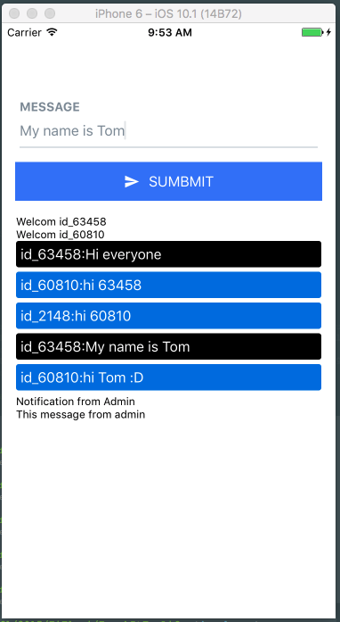

# Introduce


Chat-App-MQTT-React-Native is a application to help beginer interact MQTT(M2M) with platform `React-Native`.

Let's try it.

# Installation

1. Install package
```
npm install
```
or using `yarn`
```
yarn
```

2. Link Icon library

```
react-native link
```

# Usage

Ios
```
react-native run-ios
```
or Android
```
react-native run-android
```
